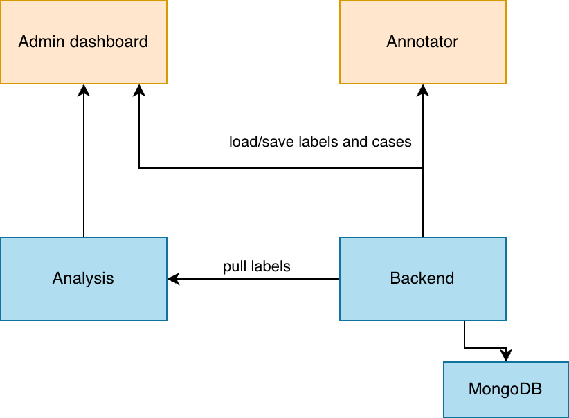

OpenRadBench is a research platform for conducting reader studies to evaluate humans and AI models. In studies, users could upload custom datasets in a DICOM standardised four-tier hierarchy. Annotators could be either AI or Human. Each annotator could annotate a case or review an annotation (including their own). 

## Prerequisites
- Mac or Linux (Windows not tested)
- Docker and Docker Compose
- uv installed
- Python 3.12+
- Node 22+

## Repository structure
- backend: Backend API for the platform
- frontend: Frontend for the annotation tool
- dashboard: Frontend for the admin dashboard
- analysis: Backend for the analysis

