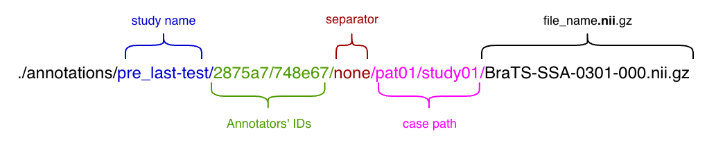

The backend is fairly simple code (so far), just a REST API with 3 base routes: `/annotations/`, 
Each one handles exactly what the name says. For any data storage, data is stored on MongoDB. And for large files, it is stored on the desk (on file storage so far). However, a few concepts/ideas could be very handy when exploring this code. 

## Annotator creation 
Every annotator is either Human or AI. They could get assigned to annotate a case or review an annotation. Every annotator has a unique ID for the study in which they are created. This ID is used in the annotation tool to load their annotation cases. 

They could be created in bulk and assigned random cases/reviews.

**Important concept:** 
- **Input:** Nothing (case to annotate from scratch) or a base label to review and edit. 
- **Output:** Must output a label file.	
 
## Case assignment 
When an annotator gets assigned to a case, this means they will do the label from scratch. This is mostly used for AI. 

## Review assignment 
When an annotator gets assigned to review an annotation, this means whenever that annotation is marked as “Ready”, they will be able to see the label on the annotation tool to review and evaluate. 

Every annotation label could be “not started”, “in progress” or “Ready”. Annotators could be assigned to review any labels, even “not started” and “in progress”. However, they will be able to work on it only when it gets “Ready”. This mechanism allows to asigen Annotator1 to review Annotator2 … to review AnnotatorN even if AnnotatorN didn’t start working yet. 

### The catch? 
After marking an annotation as Ready, the file is copied to all reviewers to start working on it. If the annotator or the admin changes the status back to “in progress” or “not started”, then edit the annotation, then mark it as “Ready”, the file copy will override the reviewer's work.
 
So after marking an annotation as Ready, annotators are blocked from changing the state. Admins can still change it, but please be cautious. 

## Annotation path 
This is the most important idea. It will be extended soon (see limitations section) to optimise speed and increase usability.



All annotations are saved at `./annotations`

### Study name 
The active study name. This is referred to in code by “study name” or “dataset name”. Since originally this was designed to hold one study and one dataset, they used to share the same name. Now they are separated. 

### Annotators
A list of every annotator who worked on this file, sorted from oldest. For example, in the above path, annotator `748e67` was assigned the case and made the original label. Then annotator `2875a7` reviewed their work.

This annotator's list is considered infinite for any real use case. Theoretically, a Linux path could be up to 4096 characters ≃ 670 reviews. 

### None 
Separates case path and annotators. Used to decompose the path throughout the code.

### Case path 
This is an adaptation to the DICOM hierarchy. The original DICOM hierarchy is `patient/study/series/file(s)`. This works fine for scans. For segmentation, we place the label file at the level it is used. 

Example: 
Lets assume this patient:
```text
pat1/
	pre-op/
		t1/t1.nii
		t2/t2.nii
		t1c/t1c.nii.gz
	post-op/
		t1/t1.nii
		t2/t2.nii
		t1c/t1c.nii.gz
```

Let's assume we work with 2 models/annotators. `Annotator1` takes T1, T2, and T1c pre-op and creates a label. `Annotator2` only takes post-op T2 and creates a label. 

Then the `Annotator1` path would be:
`./annotations/study_name/Annotator1/none/pat1/pre-op/sig.nii.gz`

Then the `Annotator2` path would be:
`./annotations/study_name/Annotator2/none/pat1/post-op/t2/sig.nii.gz`

### Survey 
The study admin could make a survey. This survey is collected for every annotation path. So in the above example, `748e67` submitted one and `2875a7` submitted another one. 
